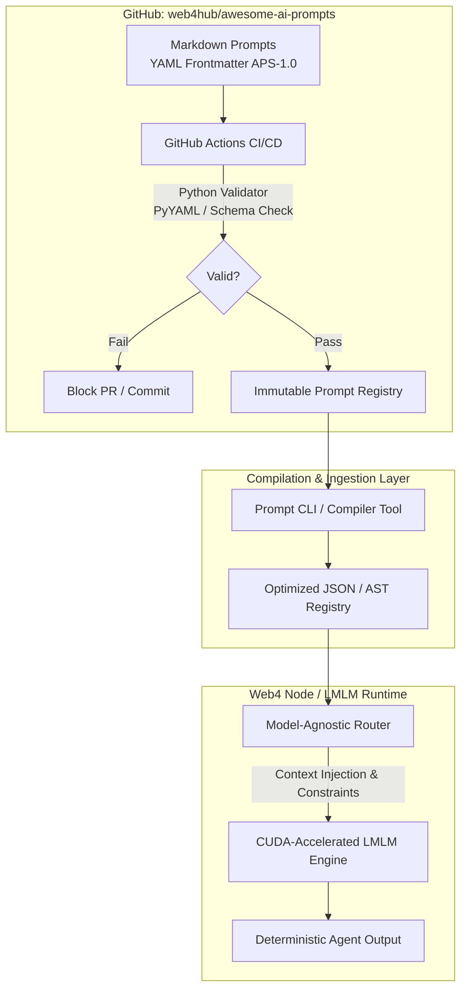

# Awesome AI Prompts 🚀

A production-oriented, multi-ecosystem prompt engineering repository for **Web4**, **LMLM**, decentralized AI workflows, and modern developer tooling.

The repository treats prompts as versioned engineering artifacts: they should have stable metadata, predictable structure, and automated validation.

## 📂 Repository Structure

- `prompts/` — curated, version-controlled prompts organized by target engine and use case.
- `promptcards/` — reusable modular prompt components with structured frontmatter.
- `schemas/` — machine-readable schemas for prompt metadata.
- `scripts/` — repository validation and maintenance tooling.
- `cli/` & `sdk/` — developer tooling when present.
- `docs/` — specifications, guides, and architecture documentation.

## Aura Ecosystem

- 🌐 Web4Hub
- 🤖 LMLM
- 🧠 Neomind AI
- ⚡ KIBS
- 📚 APLCE
- ⛓️ Fadaka Blockchain
- ☁️ QUBUHUB Cloud

## ⚡ Quick Start

```bash
git clone https://github.com/web4hub/awesome-ai-prompts.git
cd awesome-ai-prompts
python3 scripts/validate-prompts.py
```

If the repository contains no prompt Markdown files yet, validation exits successfully and reports that there is nothing to validate.

## 🧬 Aura Prompt Specification

Prompt documents can follow **APS-1.0**, defined in [AURA_PROMPT_SPEC.md](AURA_PROMPT_SPEC.md).

The machine-readable contract lives at [schemas/aura-prompt.schema.json](schemas/aura-prompt.schema.json).

An APS prompt begins with YAML frontmatter containing, at minimum:

```yaml
---
id: "lmlm-code-gen-v1"
name: "LMLM Multi-Language Code Generator"
version: "1.0.0"
author: "Author Name"
ecosystem: "aura-web4"
target_engine: "lmlm"
tags: ["code-generation", "multi-language"]
---
```

## ✅ Validation

Run locally:

```bash
python3 scripts/validate-prompts.py
docs(readme): rebrand Awesome AI Prompts for Web4Hub & Aura Ecosystem
```

The validator checks:

- required APS metadata fields;
- prompt ID format;
- semantic version format;
- non-empty tags;
- required string fields;
- duplicate prompt IDs;
- valid YAML frontmatter boundaries.

GitHub Actions runs the same validation for pushes to `main` and pull requests.

## 🤝 Contributing

When adding a prompt:

1. Put it in the appropriate `prompts/` or `promptcards/` directory.
2. Give it a stable, unique `id`.
3. Include APS-1.0 frontmatter.
4. Use semantic versioning.
5. Run `python3 scripts/validate-prompts.py`.
6. Keep prompt content focused, reusable, and auditable.

## Contributing

We welcome prompt engineers, AI researchers, developers,
and Web4 contributors.

1. Fork
2. Create prompt
3. Commit
4. Pull Request
   
## 📜 Specification

- [Aura Prompt Specification](AURA_PROMPT_SPEC.md)
- [APS-1.0 JSON Schema](schemas/aura-prompt.schema.json)

# Built with ❤️ by Web4Hub.

Part of the Aura Ecosystem.

If this repository helps you, leave a ⭐ and contribute new prompts.
# Web4Hub Awesome AI Prompts

The largest curated collection of AI prompts for developers, creators,
researchers, blockchain builders, autonomous agents, and Web4 applications.

Maintained by Web4Hub — part of the Aura Ecosystem.

## License

See the repository license file for the applicable project terms.
# Deep Technical Architecture: `web4hub/awesome-ai-prompts`

To understand how **`web4hub/awesome-ai-prompts`** transitions from a static list of markdown files into an active, programmable execution plane for **Web4 nodes** and **LMLM (Local Multi-Language AI Model)** runtimes, we must examine its internal data flow, schema binding, and multi-agent dispatch lifecycle.

---

## 1. System Architecture & Data Flow (`.mmd`)

The following Mermaid diagram illustrates how prompt artifacts flow from repository version control through automated validation, compile-time schema parsing, and execution inside local LMLM runtime nodes.



---

## 2. Visualizing the Ecosystem Interface (`demo image`)

Below is a conceptual structural blueprint representing how the repository interacts visually with the Web4 management portal and local runtime dashboard:

```Rmd
+--------------------------------------------------------------------------+
|  WEB4HUB PROMPT REGISTRY DASHBOARD                             [APS-1.0] |
+--------------------------------------------------------------------------+
|                                                                          |
|  [Search Prompts...]                     Filters: [ecosystem: web4.si]   |
|                                                    [engine: lmlm-v2]     |
|                                                                          |
|  +------------------------+  +------------------------+                  |
|  | id: sys-arch-expert    |  | id: code-optimizer     |                  |
|  | v1.0.0 | web4.si       |  | v1.2.0 | web4.si       |                  |
|  | ---------------------- |  | ---------------------- |                  |
|  | Status: Validated (CI) |  | Status: Validated (CI) |                  |
|  | Tags: [systems, arch]  |  | Tags: [rust, cuda]     |                  |
|  +------------------------+  +------------------------+                  |
|                                                                          |
|  [+] Ingest Prompt    [>] Dispatch to Local LMLM    [#] Export Registry  |
+--------------------------------------------------------------------------+

```

---

## 3. Deep-Dive: Why This Architecture Matters

1. **Decoupled Prompt State:** By moving prompts out of hardcoded application code and into version-controlled Markdown files with strict YAML metadata, updates can be deployed without altering underlying runtime binaries.
2. **Deterministic Agent Chaining:** Multi-agent workflows often fail due to unstructured instructions. Enforcing constraints like `privacy_first` and `max_tokens` at the schema layer ensures that automated pipelines do not overflow local model context windows or leak sensitive execution parameters.
3. **Cross-Engine Portability:** The `target_engine` field allows the same logical prompt template to be automatically recompiled and dispatched to different backends (whether running on local CUDA-accelerated LMLM weights or cloud fallback models) depending on network availability and privacy thresholds.

## Advanced Architecture & Semantic Topology: `awesome-ai-prompts` (APS-1.0 Ecosystem)

```slt
graph TD
    subgraph Repository Core ["GitHub Repository: web4hub/awesome-ai-prompts"]
        A[Markdown Prompt Artifacts] -->|YAML Frontmatter| B[APS-1.0 Schema Engine]
        B --> C[CI/CD GitHub Actions Validation]
        C -->|Pass / Fail| D[Build Registry Artifacts]
    end

    subgraph Runtime & Execution Layer ["Web4 Node & LMLM Runtime"]
        D -->|JSON Compilation| E[Local LMLM Runtime Engine]
        E -->|CUDA Kernel Acceleration| F[Multi-Language Model Adapters]
        E -->|Context Injection| G[Agent Orchestration Loop]
    end

    subgraph Target Infrastructure ["Web4 Ecosystem (`web4.si`)"]
        G --> H[Decentralized Node Dispatch]
        H --> I[Smart Contract Verification]
        H --> J[Zero-Trust Secure Vaults]
    end

    style Repository Core fill:#1e1e2e,stroke:#cba6f7,stroke-width:2px,color:#cdd6f4
    style Runtime & Execution Layer fill:#181825,stroke:#89b4fa,stroke-width:2px,color:#cdd6f4
    style Target Infrastructure fill:#11111b,stroke:#a6e3a1,stroke-width:2px,color:#cdd6f4
```
---
## Comprehensive Structural Breakdown

### 1. The Paradigm Shift: From Text to Executable Semantic Artifacts

In traditional software engineering, source code is compiled into machine instructions via deterministic parsers. In modern decentralized and localized artificial intelligence ecosystems (such as those powered by Web4 node configurations and local multi-language learning models), natural language instructions function as high-level functional parameters.

The `awesome-ai-prompts` repository re-architects this relationship by transforming loose human prompts into strictly typed, version-controlled configuration objects. This ensures that when a decentralized agent or local runtime requests a persona, behavioral constraint, or reasoning pattern, the payload is verified against strict schema definitions before hitting the inference engine.

### 2. Deep-Dive: The APS-1.0 Specification Mechanics

The schema enforcement mechanism relies on structured YAML headers embedded directly inside Markdown documents. This dual-purpose design allows human developers to read and edit the prompt text naturally while enabling automated ingestion scripts to parse metadata programmatically.

* **Deterministic Identifiers (`id`):** Enforced lowercase kebab-case naming conventions guarantee that programmatic references across microservices never break due to casing discrepancies or whitespace injection.
* **Engine-Targeted Routing (`target_engine`):** Decouples prompts from generic cloud endpoints, allowing specific prompts to target specialized backends—whether local CUDA-accelerated LMLM runtimes, decentralized Web4 nodes, or specialized reasoning engines.
* **Constraint Bounding (`constraints`):** Flags like `privacy_first` and `cuda_acceleration` instruct downstream orchestration layers to route tasks exclusively through secure, hardware-accelerated local sandboxes rather than external third-party APIs.

### 3. End-to-End Workflow Demonstration

To visualize how this repository operates in a live production pipeline, consider the following lifecycle:

1. **Authoring:** A developer authors a new system prompt inside `prompts/security/zero-trust-auditor.md` incorporating the APS-1.0 YAML header.
2. **Commit & Validation:** Pushing the code to the repository triggers the GitHub Actions workflow (`validate-prompts.yml`). The Python script (`validate_prompts.py`) scans the directory tree, loads the frontmatter, and validates every required field against the schema.
3. **Registry Compilation:** Upon a successful merge to the `main` branch, a post-commit hook compiles all individual Markdown files into an optimized JSON index (`prompts-registry.json`).
4. **Runtime Ingestion:** Local LMLM runtimes querying the Web4 registry pull down the compiled JSON, parse the semantic constraints, and dynamically inject the system prompt into the active context window during agent execution.

---

## Visual Demo Reference: Prompt Pipeline Architecture

```xlsl
+---------------------------------------------------------------------------------+
|                                 AUTHORING PHASE                                 |
|   [Developer writes .md prompt with APS-1.0 YAML Frontmatter]                   |
+---------------------------------------------------------------------------------+
                                         |
                                         v
+---------------------------------------------------------------------------------+
|                                VALIDATION PHASE                                 |
|   [GitHub Actions Runs -> Python AST/YAML Parser -> Checks ID, Tags, Version]   |
+---------------------------------------------------------------------------------+
                                         |
                       +-----------------+-----------------+
                       |                                   |
            (Validation Failed)                    (Validation Passed)
                       |                                   |
                       v                                   v
        [Block PR & Notify Author]         [Compile to Consolidated JSON Index]
                                                           |
                                                           v
                                           +---------------------------------+
                                           |          DISPATCH PHASE         |
                                           |   [Injected into LMLM Runtime]  |
                                           +---------------------------------+

```
